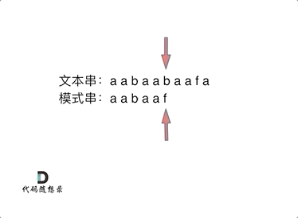

字符串
<!-- more -->

# 反转字符串

[LeetCode.344](https://leetcode.cn/problems/reverse-string/submissions/495164492/)

双指针很简单；

核心代码：
```C++
void reverseString(vector<char>& s) {
    int left=0;
    int right=s.size()-1;
    while(left<right){
        char temp;
        temp=s[left];
        s[left]=s[right];
        s[right]=temp;
        left++;
        right--;
    }
}
```

# 反转字符串Ⅱ（⭐）

[LeetCode.541](https://leetcode.cn/problems/reverse-string-ii/description/)

在for循环中直接每次递增2k即可，不需要递增1然后再判断相等；

核心代码：
```C++
void reverse(string &s, int start, int end){
    while(start<end){
        char temp=s[start];
        s[start]=s[end];
        s[end]=temp;
        start++;
        end--;
    }
}
string reverseStr(string s, int k) {
    for(int i=0;i<s.size();i+=2*k){
        if(i+k>s.size()){
            reverse(s, i, s.size()-1);
        }else if(s.size()-i>=k&&s.size()-i<2*k){
            reverse(s, i, i+k-1);
        }else{
            reverse(s, i, i+k-1);
        }
    }
    return s;
}
```

# 翻转字符串里的单词（⭐⭐⭐）

[LeetCode.151](https://leetcode.cn/problems/reverse-words-in-a-string/description/)

本题大致思路是先整体反转字符串，再反转每个单词，关键难点在于去除多余的空格，思路是数组章节的[移除元素](https://leetcode.cn/problems/remove-element/description/)的思路：快慢指针前进，将快指针值赋给慢指针，遇到空格不操作；难点在于要保留单词间的空格；

核心代码：
```C++
void reverse(string& s, int start, int end){
    for(int i=start,j=end;i<j;i++, j--){
        swap(s[i], s[j]);
    }
}
void removeExtraSpace(string& s){
    int slow=0;
    for(int i=0;i<s.size();i++){
        if(s[i]!=' '){
            if(slow!=0){ // 要为每个单词前加一个空格，除了第一个单词
                s[slow++]=' ';
            }
            while(i<s.size()&&s[i]!=' '){ // 继续操作
                s[slow++]=s[i++];
            }
        }
    }
    s.resize(slow); // slow的大小为去除多余空格后的大小
}
string reverseWords(string s) {
    removeExtraSpace(s);
    reverse(s, 0, s.size()-1);
    int slow = 0;
    for(int i=0;i<=s.size();i++){
        if(i==s.size()||s[i]==' '){
            reverse(s, slow, i-1);
            slow=i+1;
        }
    }
    return s;
}
```

# 找出字符串中第一个匹配项的下标（KMP⭐⭐）

[LeetCode.28](https://leetcode.cn/problems/find-the-index-of-the-first-occurrence-in-a-string/description/)

KMP算法，算法的精髓是每次不是只向后移一位，而是尽可能多的后移，依靠的就是重复的前后缀，也就是尽可能多的利用已经比较过的：

KMP算法一般不会遇到（但要知道原理），使用string类函数find即可；

核心代码：
```C++
int strStr(string haystack, string needle) {
    return haystack.find(needle);
}
```

# 重复的子字符串（⭐⭐）

[LeetCode.459](https://leetcode.cn/problems/repeated-substring-pattern/description/)


如果一个字符串由重复的子字符串组成，那么一定有重复的前后缀，因此把两个字符串相加，前后缀就还可以组成一个原本的字符串，利用这个性质即可解题；注意要掐头去尾，否则原字符串永远存在；

核心代码：
```C++
bool repeatedSubstringPattern(string s) {
    string t=s+s;
    t.erase(t.begin());
    t.erase(t.end()-1);
    if(t.find(s)!=-1){
        return true;
    }else{
        return false;
    }
}
```